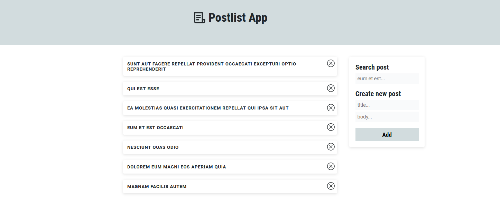

## About this project

For a coding challenge I created a simple website with the main task to manage posts.

**Features**:

- Search posts
- Delete posts
- Add posts

## Technical choices

Because it's simplicity and low amount of components, I decided to handle data with props and also passing data upwards in some cases where I wanted to seperate logic to it's respective component.

## What was left out or what could be done differently?

- Search input and data output comes late. Probably because input is listening for changes and not keydown.
- State handling with context?
- Modal instead of browser alert for form message
- Add infinite scroll
- Add Save favorite posts feature
- Cross browser testing missing

## Link to other code you&#39;re particularly proud of.

## Links

https://www.linkedin.com/in/aaron-weber-2902a5214/
